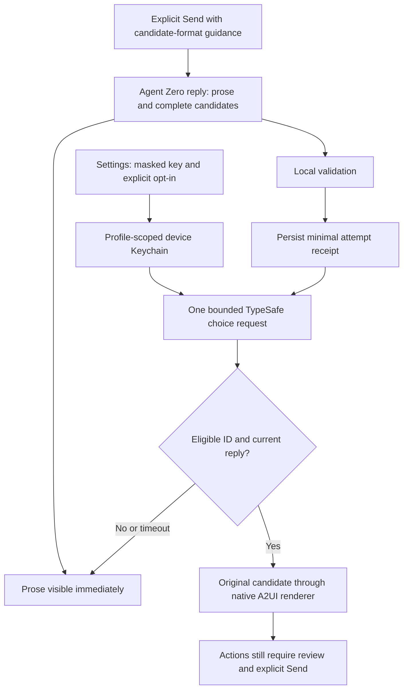

# Jev presentation selection for Agent Zero iOS

Status: approved by the user in chat; implementation in progress. Prepared September 30, 2026. Workflow: plan-canvas followed by tdd-workflow; the previous orchestration commands are superseded.

The user requested proceeding with Jev and adding a Settings field for `TYPESAFE_API_KEY`. This plan extends the existing synthetic experiment in `experiments/jev-a2ui/README.md`.

Approved architecture: a user-supplied key stays in this device's Keychain, scoped to the selected saved server profile, and iOS calls TypeSafe directly. This proposal supersedes the experiment's server-only recommendation for this optional path; it does not describe current production behavior.

The implementation belongs in `/Users/lazy/Projects/agent-zero-ios`. The separate Agent Zero server checkout is not an implementation target. Read root and owning child AGENTS.md files before edits. Existing rich replies and ordinary chat work without a TypeSafe account.

## Review at a glance

Users enter their own TypeSafe key in a masked Settings field and explicitly enable Jev. Agent Zero supplies complete presentation candidates alongside readable prose. The app asks TypeSafe to choose one eligible candidate and renders its original validated data. Prose remains available immediately and on every failure. No key is sent to Agent Zero.



## TDD execution and validation scope

After canvas approval, implement on a new `codex/jev-ios` branch. Each feature slice starts with tests and an observed intended RED result, followed by the smallest implementation and a GREEN rerun. The explicitly requested tdd-workflow includes local RED/GREEN checkpoint commits; retain those commits and map them to evidence in `docs/tdd/jev/README.md`. No push, merge, build-number bump or distribution is included.

Runner detection: this is a Swift package and native iOS app. ECC's JavaScript package-manager detector returns its default npm because there is no package.json; npm is not this project's test runner. Use Swift package tests and XCTest UI flows. Measure at least 80% line coverage for new Jev testable logic, report whole-package coverage separately, and disclose native UI/Keychain coverage limits rather than claiming an aggregate metric across incompatible tools.

The small validation allowlist below is part of this review. Run each independently, with targeted test filters where appropriate, and retain compact output. No credential-reading commands, installers or destructive operations are validation steps. Existing pinned packages may be restored into the regenerated build cache; no dependency versions or new dependencies are added.

```text
swift test --enable-code-coverage
swift test --enable-code-coverage --filter <Jev test class>
xcodebuild -project AgentZeroSpike.xcodeproj -scheme AgentZeroSpike -destination 'generic/platform=iOS Simulator' -derivedDataPath /tmp/a0-jev-derived CODE_SIGNING_ALLOWED=NO build
xcodebuild -project AgentZeroSpike.xcodeproj -scheme AgentZeroSpike -destination 'platform=iOS Simulator,id=<existing iPhone or iPad simulator UUID>' -derivedDataPath /tmp/a0-jev-derived -enableCodeCoverage YES -only-testing:A0UITests/<Jev UI test class> test
xcrun llvm-cov report <test binary> -instr-profile=<test coverage profile>
git diff --check
```

Resolve test class names, coverage paths and simulator UUIDs from the actual test targets and simulator inventory. Simulator control and build/test commands operate only on the task's test devices and temporary output. Approval covers synthetic validation, not sending real chat content or an owner API key to TypeSafe.

<a id="step-1"></a>

## Step 1 — Design the candidate and selection contract

Trace `GenerativeGuide`, `GenerativeChatAPI`, `GeneratedContent`, `GeneratedDocument`, `GeneratedSession`, `MessageRow`, and `GeneratedReplyView`. Define a versioned, explicit assistant-response-only `a2ui-candidates` envelope with readable Markdown outside the fence, bounded presentation intent, unique opaque candidate IDs, short selection descriptions, and up to four complete candidate A2UI surfaces. Markdown is an additional always-available local choice. Do not infer structured data by scraping ordinary prose or tool logs. Preserve existing single-surface `a2ui` behavior.

Each rich candidate must independently pass existing document and media validation before eligibility. Enforce an aggregate envelope byte cap (initial target 64 KiB), individual catalog limits, and bounded intent/description lengths. A Dashboard must contain at least two supported rich components. Validate structural completeness and declared provenance; do not call this verification of source truth. Jev can return only an eligible ID; original validated bytes supply the selected content. Require a useful Markdown fallback even when candidate decoding fails.

Define the minimized TypeSafe projection explicitly: bounded presentation intent, candidate IDs, selection descriptions and structural summaries only. Exclude A2UI properties, measurements, URLs, full conversation history, attachments, tool output, form values, server identity and credentials. Descriptions are untrusted text and can still reveal private information; disclose that fact in the opt-in UI rather than claiming automatic anonymization. Do not invent an accuracy threshold from the six-case experiment.

Acceptance: synthetic contract fixtures cover every supported rich presentation and Markdown; invalid or incomplete candidates cannot enter the choice set; ordinary a2ui responses and Markdown retain their current behavior.

Out of scope: Agent Zero server changes, data retrieval, arbitrary UI generation, and automatic action execution.

<a id="step-2"></a>

## Step 2 — Add secure Jev settings

Add a themed Jev section under Settings / Generative UI containing a masked `TYPESAFE_API_KEY` SecureField, explicit Save/Replace/Remove controls, a configured-state label, and an optional Use Jev control defaulting off. Explain that enabling sends limited presentation intent and candidate descriptions to TypeSafe and uses the user's API quota. Saving a key alone does not initiate evaluation or silently enable it. Keep existing Rich replies behavior independent.

Use a dedicated credential-store interface and Keychain service, separate from Agent Zero passwords and session cookies. Scope the key and enablement to the selected saved server profile so changing server does not silently use another profile's credential. Use non-synchronizing `kSecAttrAccessibleWhenUnlockedThisDeviceOnly`; store no key in UserDefaults, profile JSON, prompts, WebViews, diagnostics, URLs, screenshots or fixtures. Use isolated test services. Clear unsaved entry on dismissal/background/profile changes, do not prefill the stored key, reject empty saves, and report persistence failures accurately. Removing a profile removes its Jev key and preference; disconnect cancels active use but retains the saved profile's credential under the existing profile model.

Acceptance: synthetic storage tests cover save, replacement, removal, failures and profile isolation; UI checks cover secure entry, status, opt-in and clearing; stored keys never appear in ordinary preference or profile persistence.

Out of scope: sharing keys with the connected server, iCloud synchronization, and shipping a developer-owned API key.

<a id="step-3"></a>

## Step 3 — Implement the bounded TypeSafe choice client

Use Foundation URLSession and typed Codable request/response DTOs; no new dependency is required. Verify the current primary TypeSafe HTTP contract before implementation. The currently documented endpoint is `POST https://api.typesafe.ai/v1/systemone` with Bearer authentication, explicit model, state and named questions. Use one Choice question over eligible IDs. Record the actual response model; choose and document a supported model deliberately rather than assuming a moving alias reproduces the prior experiment.

Use a dedicated ephemeral HTTPS session with no Agent Zero cookies, redirects, shared cache or body logging. Bound request/response bytes and total evaluation time (initial target five seconds). Cancel cooperatively. Handle 401/403, 429, network failure, timeout, malformed answers, unknown IDs and unavailable credentials with typed non-sensitive outcomes and Markdown fallback. No automatic HTTP retries or credential validation calls on typing/saving. Do not treat confidence as proof of correctness or define an untested threshold.

Before an evaluation POST, persist a minimal attempt receipt consistent with the root mutation contract: opaque profile/reply identity, payload digest, attempt ID and state, no secret or prompt content. Failure to persist prevents submission. An interrupted attempt is uncertain and never replayed automatically. Keep receipt retention bounded and separate from chat-send delivery records.

Acceptance: URLProtocol tests verify exact request projection, credential isolation and redirect rejection; every failure path returns a usable fallback within the deadline; a pending or uncertain attempt is never submitted twice.

Out of scope: server proxies, automatic paid retries, and experimental json-render runtime dependencies.

<a id="step-4"></a>

## Step 4 — Integrate selection with native reply lifecycle

Advertise the candidate contract only on future explicit sends when Rich replies and Jev are both enabled with an available key. Preserve message IDs, queue behavior and ordinary send journaling; send no separate setup message. Never include the API key in the capability suffix. Preserve recognition and hiding of the exact previous capability suffix so historical messages do not expose a new block of internal guidance.

Use a conversation-owned coordinator rather than a row-owned network task. Evaluate only complete, explicitly marked new replies eligible for the current opt-in generation. Render fallback prose immediately. Use a bounded one-attempt policy per reply across source replacements and row remounts; invalidate stale results and show Markdown when a reply changes after submission. Do not reevaluate historical replies merely because of scrolling, reconnect or enabling the preference.

Fence callbacks by profile, connection generation, chat context, log epoch, reply identity, source digest and credential generation. Cancel on background, disconnect, context change, key replacement/removal or opt-out. Map a successful eligible ID to its original locally validated surface and pass it through GeneratedSession. No late result may overwrite edited form state or an open action review. Preserve existing source-link checks, media isolation, action review and explicit Add to draft / Send behavior. Update the root and child ownership contracts to describe this narrow new credential and transport path.

Acceptance: repeated polling, scrolling and view reconstruction make at most one evaluation attempt; profile/context changes and replaced replies discard late answers; selected surfaces use the existing native renderer while actions remain review-only.

Out of scope: changing chat delivery semantics, replaying server mutations, and sending generated actions automatically.

<a id="step-5"></a>

## Step 5 — Verify and document the complete flow

Run focused contract, credential, transport and lifecycle regressions plus the required Swift package tests and iOS build. Exercise synthetic iPhone/iPad UI flows for Settings, every candidate type, fallback, errors, accessibility sizes, light/dark and server-selected themes. Verify app-background handling and ensure secure fields and synthetic credentials are absent from screenshots and diagnostics. Retain compact results and selected screenshots; clean only task-owned generated output after verification.

Expand beyond the original six happy-path scenarios: malformed/missing fields, conflicting candidates, prompt-like descriptions, unsupported choices, incomplete streaming replies, duplicates, slow completion, switching profiles, replacing keys and stale action reviews. Record exact model and scenario coverage; the old six-case result is feasibility evidence only. A live check uses only synthetic content with an explicitly configured user key; do not read owner .env files or transmit real chat data for testing. Record live testing as unverified when no key is available.

Update GENERATIVE-UI.md, the experiment status, and acceptance evidence with actual implementation and test status, the opt-in data flow, Keychain ownership, quota implications, failure behavior and limitations. Audit release/privacy copy against actual transmission before a future release. This step does not bump the build, upload TestFlight, or merge anything.

Acceptance: focused regressions, required package checks and iOS build pass; iPhone/iPad synthetic flows preserve themed native UI and action review; documentation distinguishes simulated tests, live synthetic API evidence and physical-device acceptance.

Out of scope: production-chat testing, new dependency installation, pushes, merges, and TestFlight distribution.

## References

- Existing repository experiment: [Jev A2UI experiment](experiments/jev-a2ui/README.md).
- [TypeSafe HTTP API](https://docs.typesafe.ai/api), checked September 30, 2026: direct Choice endpoint and authentication contract.
- [json-render Jev experiment](https://json-render.dev/docs/jev), checked September 30, 2026: candidate-based composition; its experimental JavaScript APIs are not required for this Swift implementation.

## Approved catalog expansion

During implementation the user explicitly requested broader A2UI coverage. Include four native component types in this task: Metric (value/unit/change/source), DataTable (bounded rectangular comparisons), Timeline (bounded events and supplied status), and Checklist (a titled collection of existing bound CheckBox controls and an optional reviewed Button). Jev can select these complete candidates and Dashboard can combine them. Keep all existing size, source-link, form-state and action-review protections. Add contract and synthetic native rendering tests before implementation; no arbitrary web UI, new server action API, or unreviewed checklist submission is added.
