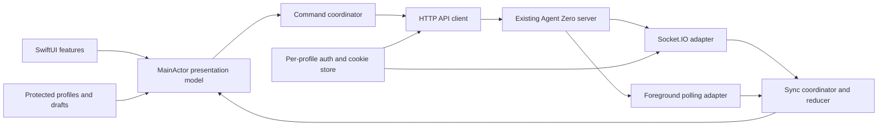
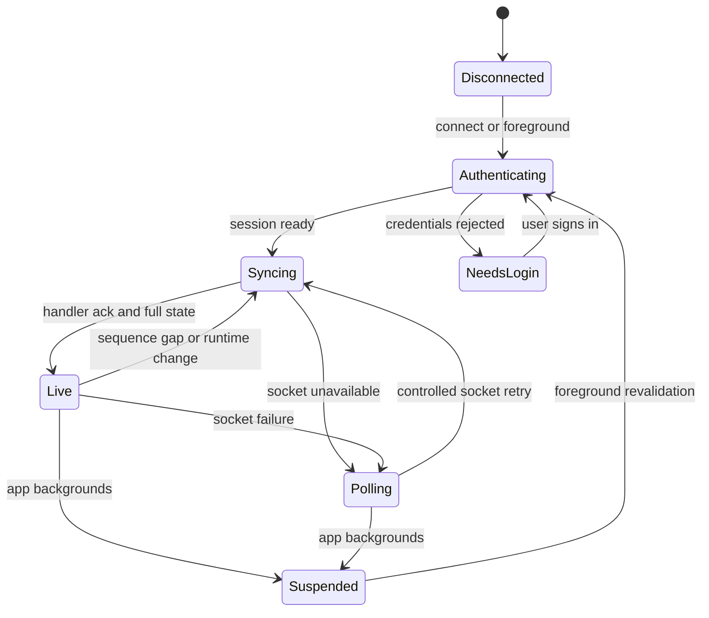

# Agent Zero for iPhone and iPad

## Revised product and implementation plan

**Status:** approved; local transport, text chat, durable drafts, saved-profile, QR-onboarding, foreground polling-recovery, and controlled realtime-promotion slices implemented; physical camera import and authenticated HTTPS/Socket.IO state observed, with keyboard-accessible Connect implemented; full milestone acceptance remains open · **Revised:** September 28, 2026
**Goal:** a native companion for an existing Agent Zero server, with dependable chat, attachments, execution controls, and recovery when the phone loses connectivity.

Agent execution stays on the server. The app makes that work accessible from a phone; it does not run Agent Zero locally. Preserve the original ambition for projects, tasks, files, and administration, delivered after the connection and conversation foundation is proven.

This revision is based on the local Agent Zero source at `/Users/lazy/Desktop/agent-zero`, HEAD `6a6cecff`, with pre-existing working-tree changes. Source inspection is evidence of contracts, not proof of a deployed server or working iOS integration. No server was contacted and no app was built for this planning pass. The original draft is preserved as `A0-iOS.original.md` beside this file.

## 1. Recommended decisions

| Decision       | Recommendation                                                                       | Why                                                                                                            |
| -------------- | ------------------------------------------------------------------------------------ | -------------------------------------------------------------------------------------------------------------- |
| Platform       | iPhone first, adaptive iPad layouts, iOS 17+                                         | SwiftUI Observation without an iOS 16 compatibility layer; revisit the minimum if device coverage requires it. |
| Product        | Native daily-use companion, progressive administration parity                        | The useful first release is a reliable conversation and control surface.                                       |
| Authentication | Session login plus CSRF for the first release                                        | This accesses the existing WebUI API. API-key mode is a separate, limited adapter later.                       |
| Networking     | HTTPS origin supplied manually or by QR; one active profile                          | Works with an existing server or tunnel without making tunnel creation a prerequisite.                         |
| State          | One reducer shared by Socket.IO and foreground HTTP polling                          | Both transports must yield identical visible state.                                                            |
| Storage        | Profile metadata and drafts persist; transcript cache opt-in later                   | Limits sensitive data retained on a lost phone.                                                                |
| Server changes | Start with existing APIs; propose narrow additions only after a failed contract test | Avoid a speculative mobile gateway or protocol rewrite.                                                        |
| Distribution   | Internal TestFlight first                                                            | Physical-device acceptance precedes broader distribution.                                                      |

These are reviewable defaults, not confirmed user preferences. Retaining iOS 16 would mean an explicit ObservableObject-based alternative. Observation's iOS 17 availability is documented by [Apple](https://developer.apple.com/documentation/SwiftUI/Managing-model-data-in-your-app).

## 2. Corrections to the preliminary draft

| Original assumption                                                | Revised contract or approach                                                                                                                                                                      |
| ------------------------------------------------------------------ | ------------------------------------------------------------------------------------------------------------------------------------------------------------------------------------------------- |
| A health request discovers whether login is required               | `health` is unauthenticated. Use it only for reachability/server evidence; `csrf_token` is the protected bootstrap request.                                                                       |
| `forceFull: true` is sent to the server                            | It is a WebUI helper option. The actual `state_request` contains zeroed cursors, context, timezone, and optionally `collections_delta`.                                                           |
| `state_push` is a plain complete snapshot                          | It is an event envelope whose `data` contains `runtime_epoch`, `seq`, and `snapshot`. Logs can be incremental; `contexts` and `tasks` can be null when unchanged.                                 |
| A session cookie and auth payload are enough for Socket.IO         | `/ws` also validates Origin and requires the runtime CSRF cookie to match the session and auth payload. An open socket is not proof the `ws_webui` handler activated.                             |
| Message IDs make retrying safe                                     | The inspected send and queue paths do not establish an idempotency guarantee. A timeout after submission is an uncertain outcome.                                                                 |
| Settings are a generic UI schema                                   | `settings_get` currently returns `settings` and `additional` metadata, not the proposed `sections` renderer contract. Native settings require explicit mapping or a new versioned schema.         |
| API keys provide another route to the same UI                      | `api_message` uses different names, base64 attachments, a completion-waiting response, and context lifetime behavior. It does not replace session auth for `poll`, `ws_webui`, or administration. |
| A runtime toggle can create an arbitrary host ATS exception        | ATS exceptions are application configuration. Keep the release path HTTPS; evaluate LAN HTTP as a separate, narrowly configured requirement.                                                      |
| Local notifications keep reporting new server work while suspended | They cannot observe events the app never receives. Remote completion alerts require a server/APNs design.                                                                                         |
| An old tunnel URL can discover its replacement                     | An unreachable origin cannot supply a new address. Provide re-scan/edit-origin recovery and confirm trust again.                                                                                  |

The ATS distinction follows [Apple's ATS configuration guidance](https://developer.apple.com/documentation/security/preventing-insecure-network-connections). The background limitation is reflected in [Apple's background strategy guidance](https://developer.apple.com/documentation/BackgroundTasks/choosing-background-strategies-for-your-app).

## 3. Release scope and navigation

### First usable release

A person scans their server's QR code, verifies the destination, signs in, opens a chat, sends text or a file, sees progress, pauses or stops execution, and returns after locking the phone to an accurate conversation.

- **Chats:** conversation list, create/select, per-chat drafts, project/profile labels, typed log stream, expandable tool details, progress, text and attachments, queue visibility and controls, pause/resume, stop, and a clearly described nudge action.
- **Activity:** in-app notification history and connection/recovery status. Do not promise background completion alerts.
- **Settings:** server profiles, authentication, diagnostics export with redaction, local privacy controls, and a user-initiated link to the server WebUI.
- Preserve drafts after errors; show sending, accepted, queued, failed, and outcome-unknown states. Distinguish server acceptance from completion of an agent run.
- Use native navigation, Dynamic Type, VoiceOver, light/dark appearance, reduced motion, keyboard-safe composition, and an iPad split layout. Do not steal scroll position while the user reads earlier content; offer “Jump to latest.”

### Expansion roadmap

| Area                       | First release                                               | Following milestones                                                                  |
| -------------------------- | ----------------------------------------------------------- | ------------------------------------------------------------------------------------- |
| Projects                   | Display active project/profile; preserve server inheritance | Project selection, creation, and editing after contract coverage                      |
| Scheduler                  | Optional read-only task summary                             | Create/edit/run/delete, timezone and daylight-saving validation                       |
| Files                      | Attach and retrieve conversation artifacts                  | Workdir browser, Quick Look, upload/download, then edit/rename/delete                 |
| Chat management            | Create and select                                           | Export, load, reset, remove with explicit destructive-action UX                       |
| Settings                   | App and connection settings                                 | Curated native server fields, then broader tested coverage                            |
| MCP / plugins              | User opens WebUI when needed                                | Native MCP status/details; plugin-specific UI remains separate                        |
| Remote control             | Connect to an existing HTTPS address                        | Tunnel status and lifecycle controls, with disconnect consequences shown              |
| Backup / restart / update  | WebUI handoff                                               | Explicit administrative workflows after recovery and export tests                     |
| Speech                     | System keyboard dictation works with text input             | Native TTS and optional speech capture, with permissions and audio interruption tests |
| API key                    | Deferred                                                    | Separate limited mode with visible capability restrictions                            |
| Notifications while closed | Deferred                                                    | Optional mobile server plugin plus APNs provider/relay design                         |

The WebUI handoff initially opens the trusted origin in the browser; a native login does not automatically sign Safari in. Do not assume browser cookie sharing. A later WKWebView would need its own cookie integration and restricted navigation design.

## 4. Architecture and ownership



Create a separate iOS project/repository once implementation is approved; do not place the native app inside the server's runtime tree. The checkout destination and bundle/signing identity are implementation inputs, not reasons to delay this plan review.

| Module        | Responsibility                                                                                |
| ------------- | --------------------------------------------------------------------------------------------- |
| A0Protocol    | Explicit Codable DTOs, flexible JSON values, event/ack envelopes, captured synthetic fixtures |
| A0Networking  | URL construction, redirects, response classification, multipart transfers, cancellation       |
| A0Auth        | Per-profile cookie jar, Keychain references, CSRF bootstrap, logout, credential invalidation  |
| A0Sync        | Transport selection, connection generation, handshake, cursors, sequence checks, reducer      |
| A0Commands    | Context-bound sends, queue actions, pending operation reconciliation                          |
| A0Storage     | Protected drafts, profile metadata, optional cache retention and deletion                     |
| A0Features    | Onboarding, Chats, Activity, Settings, followed by management features                        |
| A0TestSupport | Redacted fixtures, deterministic transport doubles, replay and interruption scenarios         |

Use Swift concurrency with explicit isolation. Keep network/decode work outside the main actor; publish UI state on the main actor. Scope all state by profile and context. Changing profile cancels the old socket, poller, transfers, and callbacks before the new connection becomes visible.

Evaluate and pin `socket.io-client-swift` through Swift Package Manager during the transport spike. Its [upstream documentation](https://github.com/socketio/socket.io-client-swift) supports polling and WebSockets, but compatibility with this Python server, current Swift toolchain, cookies, and `/ws` must be demonstrated. Do not translate JavaScript configuration options literally into Swift APIs. No hand-written Engine.IO implementation is planned.

## 5. Connection and authentication contract

1. Parse a manual or scanned URL locally. Require an HTTPS origin for release use, reject embedded credentials and unsupported URL forms, and display scheme/host/port before connecting. Initially support root-hosted deployments; reverse-proxy subpaths need explicit compatibility work.
2. `GET /api/health` checks reachability and records available version evidence. Distinguish an Agent Zero response from proxy interstitials or HTML. This request does not prove authentication.
3. `GET /api/csrf_token` bootstraps the session. Classify redirect-to-login, HTML, malformed JSON, and `{ok:false}` distinctly. When required, submit same-origin form-encoded `POST /login` with `username` and `password`, then repeat the protected bootstrap. A 200 login page is not success.
4. Keep cookies in a dedicated in-memory store per profile. Persist only the credentials/session material explicitly needed in Keychain; never use global shared cookie state across profiles. Use runtime-bound cookie names returned through the bootstrap/session exchange.
5. Send `X-CSRF-Token` on protected HTTP calls. For Socket.IO, supply the session cookie, `csrf_token_<runtime_id>` cookie, auth `{csrf_token, handlers:["ws_webui"]}`, and an Origin matching the approved server origin. Never weaken server Origin checks to make the client connect.
6. Connect the `/ws` namespace, verify the `ws_webui` acknowledgement, and perform a full state request. Discover/verify the Engine.IO path in the spike; namespace and transport path are separate concepts.
7. On runtime rotation or expired auth, invalidate the affected session/CSRF state and bootstrap again. Bound credential retries and surface an explicit sign-in state instead of looping.

Prevent credential-bearing cross-origin redirects and HTTPS downgrades. An origin change requires a fresh user trust decision, not automatic forwarding of saved credentials. Normal platform TLS validation is the default; never accept invalid certificates to recover connectivity.

For the first release, remote use requires server authentication. Auth-disabled development environments are a separate compatibility case: the current CSRF bootstrap checks Origin and can initialize server `ALLOWED_ORIGINS`. Do not treat it as a harmless read-only probe of an unauthenticated production instance.

## 6. Realtime state and recovery



Actual state request data:

```json
{
  "context": null,
  "log_from": 0,
  "notifications_from": 0,
  "timezone": "America/Indiana/Indianapolis",
  "collections_delta": true
}
```

The example timezone is illustrative; send the device's valid IANA identifier. Client event envelopes also carry `ts`, `data`, and `correlationId`. Read the matching handler result, including application errors that may occur inside a successful transport acknowledgement.

Reducer invariants:

- Consume `state_push.data.snapshot` with its `runtime_epoch` and `seq`; `/api/poll` returns the snapshot directly. Treat `seq_base` in the handshake as the sequence baseline rather than hardcoding it.
- Track log and notification GUIDs and versions separately. Merge incremental log updates by stable log identity/order; updates may replace an existing streaming item. Reconcile optimistic entries with server IDs.
- Null `contexts` or `tasks` means retain the previous collection; an empty array means an empty collection. Decode `log_progress` as its actual string-or-integer wire type.
- A GUID reset, epoch change, sequence discontinuity, or new connection requires appropriate cursor reset/full resynchronization. A new connection must handshake even if the app missed a disconnect callback.
- Serialize handshakes. Tag asynchronous work with profile/context/connection generations; discard stale responses after a switch. Never mix two active transport writers.
- Poll only while foregrounded, with one request in flight and adaptive backoff/jitter. Try Socket.IO recovery at a bounded cadence; resynchronize before handing ownership back.
- Save drafts on backgrounding. Revalidate and refresh on foregrounding. Do not promise continuous sockets or polling while suspended.

Use tolerantly decoded optional fields and unknown log types, but fail visibly for incompatible required contracts. The current snapshot type name is not a negotiated mobile API version. Start with an explicit tested-server compatibility matrix, not a claim to support every Agent Zero release.

## 7. Messages, queue, and attachments

Create/select a context first and freeze that context ID for the operation. `chat_create` returns `ctxid`; `message_async` returns `context` with an acceptance message. Do not conflate these fields.

- Text: JSON `message_async` with `text`, `context`, and `message_id`.
- Direct attachments: multipart `message_async` with those fields and repeated `attachments` file parts.
- Queue attachments: upload first to `/api/upload` with repeated `file` parts; pass returned filenames to `message_queue_add` with `context`, `text`, and `item_id`. This differs from the direct-send path.
- Queue when the observed context is running or already has queued/pending messages. Serialize local sends and queue edits. Test busy-state races; the server remains authoritative.
- Confirm complete upload success before enqueueing. Stage files with collision-resistant names while preserving display names; do not silently drop failed attachments or resend the whole message after a partial failure.
- Select files through native Photos/Files pickers, stream multipart bodies from disk, clean temporary files, handle cancellation and 413 responses. Set a documented mobile limit, initially proposed at 25 MiB per file and 50 MiB per operation, subject to review and server/proxy limits.

The backend's default HTTP limit is currently 5 GiB and environment-overridable; the Socket.IO buffer is 50 MiB in inspected source. Neither is a suitable mobile upload policy or evidence of a discoverable public upload-limit API.

### Uncertain sends are a first-class state

After a timeout, reconcile logs/queue for the existing message or item ID. If the result remains unknown, show “Delivery uncertain” and let the person decide whether to retry. Do not automatically replay sends, queue mutations, task runs, or destructive actions. A matching log is evidence of receipt, not proof an agent completed the request. Exactly-once execution would require a documented server-side idempotency contract and tests.

Pause/resume, stop, and nudge must retain their distinct backend meaning. Stopping an agent does not roll back external actions already performed. Show the selected chat and await confirmation from server state; never imply that merely disconnecting stopped work.

## 8. Privacy, rendering, and administration

- Default Keychain accessibility to when-unlocked, device-only for foreground credentials. Broader background access requires a concrete later requirement.
- Protect persisted drafts and temporary files with iOS data protection. Make retention and deletion explicit; clear profile-scoped credentials, cookies, and cached content on disconnect/delete as appropriate.
- Render Markdown and code as content. Never execute server-provided HTML, JavaScript, shell commands, or plugin UI inside the native transcript. Confirm external links and avoid automatic remote image fetches that could disclose activity to third parties.
- Use a typed log renderer with an unknown-type fallback and a redacted raw-detail view. Deferred details are a separate contract to fixture-test, not assumed to be present in every initial snapshot.
- Diagnostics contain transport state, durations, status/error classifications, and tested server identity. Exclude passwords, tokens, cookies, message bodies, filenames, and sensitive URLs by default.
- Native server settings start from an allowlist with explicit mappings. Preserve unknown fields and secret placeholders; submit only supported changes using verified server semantics. Do not round-trip a stale full settings object over concurrent WebUI changes.
- Admin actions show their scope and consequences: stopping the active tunnel or restarting the server can sever the connection. Never retry these automatically after a disconnect.
- Remote notifications are a separate project: device registration/revocation, server-side APNs credentials or a relay trust boundary, opaque notification payloads, and authenticated fetching when opened. APNs provider requirements are described by [Apple](https://developer.apple.com/documentation/usernotifications/setting-up-a-remote-notification-server).

## 9. Implementation milestones and exit gates

| Milestone                        | Deliverables                                                                                                                         | Exit evidence                                                                                                                                       |
| -------------------------------- | ------------------------------------------------------------------------------------------------------------------------------------ | --------------------------------------------------------------------------------------------------------------------------------------------------- |
| 0 — Contract and transport spike | Select isolated iOS workspace and test instance; synthetic fixtures; endpoint/auth matrix; minimal Swift login → poll → `/ws` client | Real iPhone and simulator establish authenticated state on one HTTPS deployment; denied auth/CSRF/Origin remain denied; exact versions recorded     |
| 1 — Native vertical slice        | Profiles, QR/manual onboarding, chat list/create/select, text send, reducer, polling fallback, lifecycle recovery                    | One synthetic conversation remains correct through lock/unlock, reconnect, context switching, and server restart                                    |
| 2 — Daily-use chat               | Typed logs, deferred details, attachments, queue, pause/resume/stop/nudge, drafts, Activity, diagnostics                             | Interrupted/ambiguous sends never cause silent replay; upload/queue and control scenarios pass; accessibility and long-history performance measured |
| 3 — Internal TestFlight          | Signed build, privacy declarations, permissions, device acceptance checklist, compatibility notes                                    | Build available to intended internal testers plus a separate physical-device acceptance record; upload alone is not acceptance                      |
| 4 — Management parity            | Projects, scheduler, files, curated settings, MCP and selected admin flows                                                           | Contract tests and destructive-action/recovery tests for each newly enabled feature                                                                 |
| 5 — Optional capabilities        | API-key adapter, speech, remote notifications, optional embedded plugin views                                                        | Each has its own capability/security contract and device evidence before release                                                                    |

Milestone 0 is the dependency for all feature work. Avoid scheduling independent feature work against an unproven transport contract. These are dependency gates, not calendar promises; estimate dates after the spike exposes actual compatibility costs.

If the Swift Socket.IO client cannot meet the security/transport contract, deliver the vertical slice using foreground polling while investigating a replaceable realtime adapter. If current APIs cannot meet a required behavior, document a minimal server/plugin change before implementation; preserve existing authentication and CSRF protections.

## 10. Verification and acceptance

| Layer             | Required checks                                                                                                                                                                                          |
| ----------------- | -------------------------------------------------------------------------------------------------------------------------------------------------------------------------------------------------------- |
| Protocol/reducer  | Full and incremental fixtures; null/empty collections; unknown log types; streaming replacement; GUID reset; sequence gaps; stale-generation suppression; identical final state through push and polling |
| Auth              | Correct/wrong credentials; HTML login response; token expiry; runtime rotation; missing/wrong CSRF cookie; missing/wrong Origin; cross-origin redirect rejection; profile isolation                      |
| Commands          | Create-before-send; busy queue behavior; dropped response before/after receipt; multipart upload interruption; partial upload; queue cancellation; stop while offline; no silent replay                  |
| UI                | VoiceOver, large Dynamic Type, keyboard, long messages/code, iPad split view, scroll stability, permissions denied, drafts after failure                                                                 |
| Real devices      | Wi-Fi/cellular transition; offline/online; screen lock; app termination/relaunch; server restart; expired tunnel; selected tunnel provider; invalid certificate                                          |
| Server regression | Focused existing snapshot/schema/auth tests, plus any tests belonging to an approved server change, run in the framework runtime                                                                         |
| Release           | Dependency/license review, privacy disclosures, signing, TestFlight availability, physical-device checklist, redacted support export                                                                     |

Initial performance targets to validate: interactive scrolling with a 5,000-entry synthetic history through lazy rendering; no unbounded view/model growth during a 30-minute stream; UI reflects incoming state within 250 ms after decoding under the reference workload; recovery reaches a current view within 10 seconds after a healthy connection is re-established, excluding user sign-in. Record device, server, network, and workload with measurements before claiming these targets passed.

Test one selected HTTPS/tunnel deployment first and expand provider coverage deliberately. The server supports several tunnel providers; that does not establish equivalent native-client behavior on all of them. Live tests use a dedicated synthetic chat/instance, not unrelated user sessions. Do not restart an existing user server just to exercise recovery.

## 11. Decisions to settle during review

The defaults above allow planning to proceed. The most consequential choices are:

1. **Platform coverage:** keep iOS 17+, or retain iOS 16 with the additional state-management compatibility work.
2. **First TestFlight scope:** keep daily-use chat as the gate, or promote a specific management feature that is essential to your workflow.
3. **Connectivity:** HTTPS-only release baseline, or make plain-HTTP LAN support an explicit additional workstream.
4. **Background alerts:** defer APNs, or prioritize a server integration and its ongoing operational ownership.

Approve the plan to proceed to Milestone 0, or annotate changes here. Approval starts implementation planning and the bounded spike; it does not silently authorize production changes, paid services, dependency installation, commits/pushes, or App Store submission. Repository-specific permission rules still apply when those steps become concrete.

## 12. Source evidence for implementation

These are inspected source locations in the current checkout; recheck them against the exact target revision during Milestone 0. The draft's copied snippets are retained in the original backup rather than treated as a permanent API specification.

| Contract                                              | Source                                                                                                                                                                                                |
| ----------------------------------------------------- | ----------------------------------------------------------------------------------------------------------------------------------------------------------------------------------------------------- |
| Health, CSRF bootstrap, login, cookie names           | `api/health.py`, `api/csrf_token.py`, `helpers/ui_server.py`, `helpers/api.py`                                                                                                                        |
| Socket namespace, Origin, cookie and handler security | `helpers/ws.py`, `helpers/ui_server.py`                                                                                                                                                               |
| Request parsing and acknowledgement                   | `extensions/python/webui_ws_event/_10_state_sync.py`, `helpers/state_snapshot.py`                                                                                                                     |
| Push shape, sequencing, collection deltas             | `helpers/state_monitor.py`, `helpers/state_snapshot.py`, `webui/components/sync/sync-store.js`                                                                                                        |
| Snapshot application and send behavior                | `webui/index.js`, `webui/js/messages.js`                                                                                                                                                              |
| Create/send/queue/upload                              | `api/chat_create.py`, `api/message.py`, `api/message_async.py`, `api/message_queue_add.py`, `api/upload.py`, `helpers/message_queue.py`, `webui/components/chat/message-queue/message-queue-store.js` |
| API-key differences                                   | `api/api_message.py`, `helpers/api.py`                                                                                                                                                                |
| Settings shape and update behavior                    | `api/settings_get.py`, `api/settings_set.py`, `helpers/settings.py`                                                                                                                                   |
| Execution controls                                    | `api/pause.py`, `api/stop.py`, `api/nudge.py`                                                                                                                                                         |
| Existing regression anchors                           | `tests/test_snapshot_schema_v1.py`, `tests/test_snapshot_parity.py`                                                                                                                                   |

**Evidence limit:** the revised design is source-backed and reviewed against primary Apple/Socket.IO documentation. Runtime interoperability, device behavior, performance, and distribution remain implementation acceptance work.


## UI reference refinement — 2026-09-28

The user confirmed collapsible long messages/tool output and following new replies until reading history. Agent Zero WebUI logos and palette remain primary. The supplied Goose mobile examples inform progressive tool disclosure, navigation, notices and future voice modes; see [reference decisions](GOOSE-REFERENCES.md) for implementation boundaries and source links. Native Markdown, explicit draft navigation and grouped activity are implemented in this chat UI slice. Sidebar/favorites and voice remain distinct follow-on work with their original persistence, authentication and delivery guarantees.
